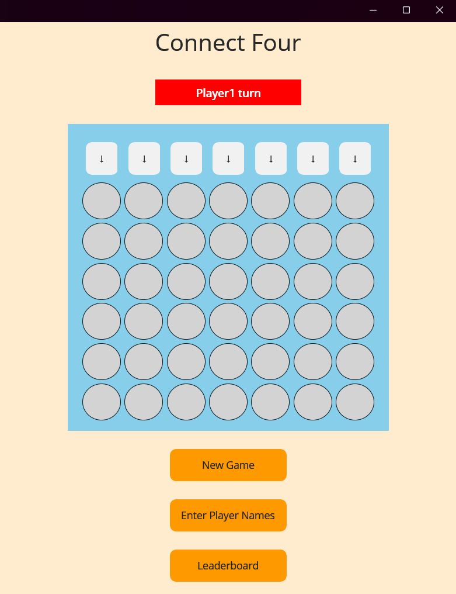
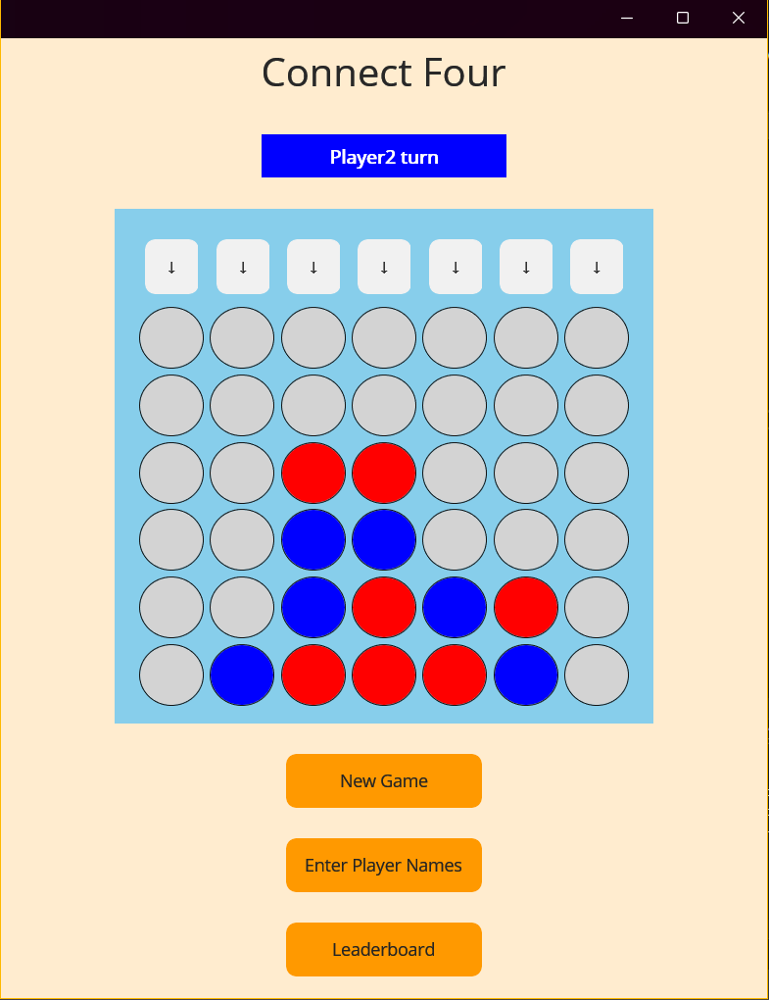
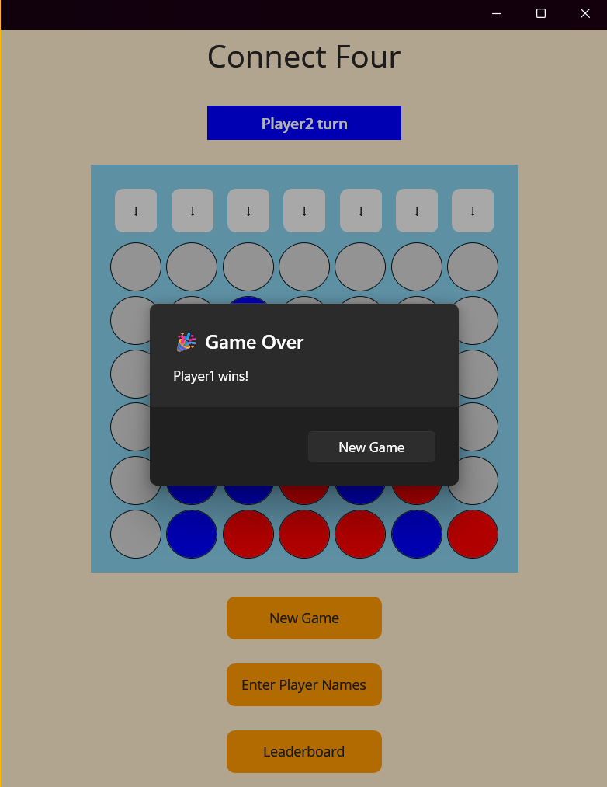
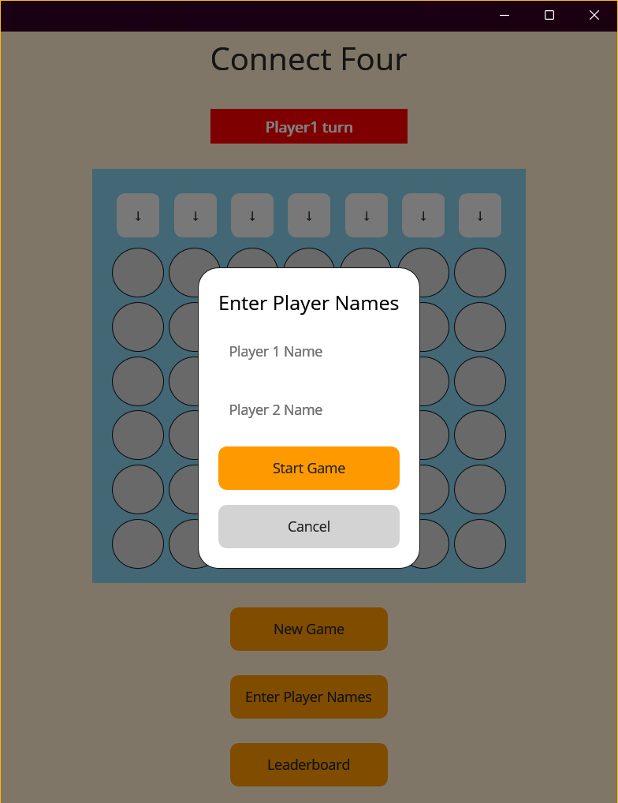
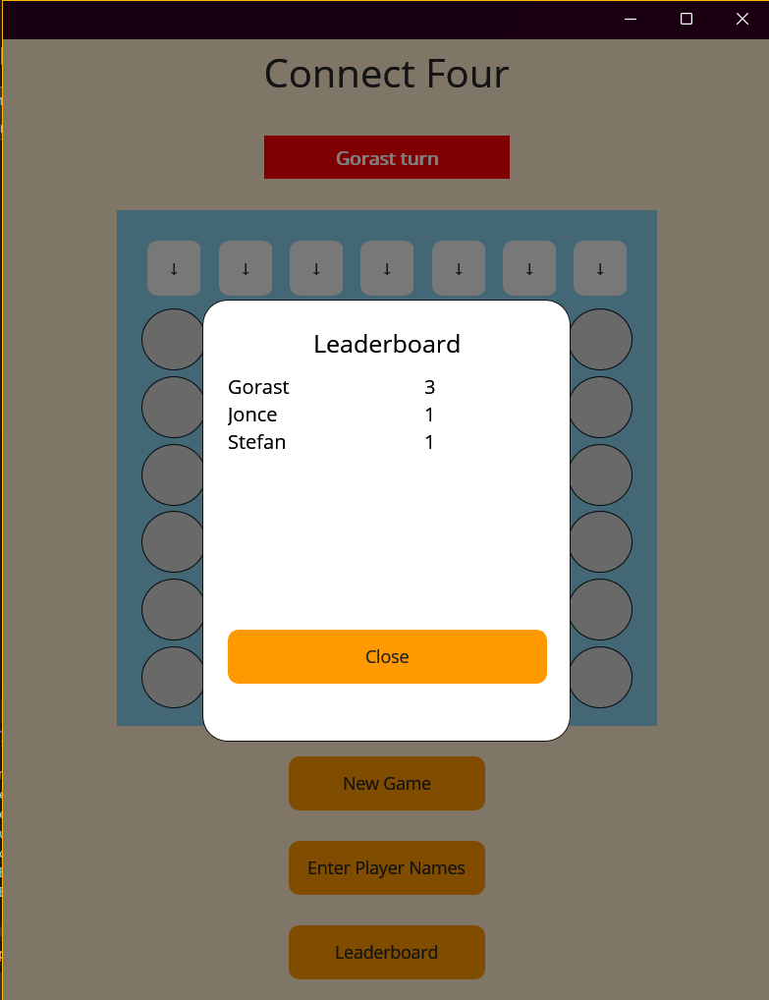

<h1>ConnectFour game</h1>

<h3>.NET MAUI проект по визуелно програмирање, Гораст Палоски </h3>

1.Опис на апликацијата/играта

-При стартување на апликацијата во корисничкиот интерфејс ја гледаме таблата за играње, индикатор за кој играч е на ред и 3 дугмиња (New Game, Enter player names, Leaderboard).
-Играта се игра така што се додаваат токени наизменично и победува тој што прв ќе состави низа од 4 токени, вертикално, хоризонтално или дијагонално.
Токени се додаваат со кликање на дугмињата во првиот ред на табелата и секој токен се става на најдолната слободна позиција.

Во позадина играта работи преку класите Game и Player.
-За секоја игра се креира нов објект од класата Game кој што како аргументи прима имиња за двајцата играчи. При иницијализација на објектот тој 
креира и чува 2 објекти од класата Player, матрица за таблата за игра, број за кој играч е на ред и стринг иницијално поставен на "none" за тоа кој е победник.

При секое додавање на токен се повикува метод кој што тоа ќе го запише во матрицата и потоа метод за проверка дали има победник.
Доколку пронајде победник на екран се отвара DisplayAlert со порака кој играч победил и опција за нова игра.

2. Функционалности на дугмињата

  -Дугмето "New Game" ја рестартира моменталната игра, односно ги брише сите токени од таблата и почнува нова игра со истите играчи од тековната.

  -На дугмето "Enter player names" се отвара модален панел со 2 текстуални полиња и 2 дугмиња за старт на игра со внесените имиња или за затворање на панелот.
  При внесување на имиња и клик на дугмето "Start game" се повикува функција која започнува нова игра со двајцата внесени играчи и го затвора панелот. 
  

  

  -Дугмето "Leaderboard" отвара модален панел со табела на играчи и нивниот број на победи, сортирани според бројот на победи по опаѓачки редослед. При секоја победа на играч се повикува функција 
   која доколку името на победникот е различно од "Player1" или "Player2", проверува дали играчот веќе се наоѓа во локална листа од Player
   објекти пребарувајќи преку името на играчот. Доколку не е на листата додава нов објект, а доколку играчот веќе се наоѓа на листата го зголемува 
   неговиот број на победи и ја ажурира листата.

   

Апликацијата беше развиена во .net MAUI. За некои од методите беа користени информации од интернет форуми и помош на вештачка интелигенција. 
Вештачка интелигенција беше користена за функцијата за проверка на победник и за xaml дизајнот на модалните панели за внесување на имиња и панелот за тебела со победи.
Гораст Палоски, индекс 233045
   

